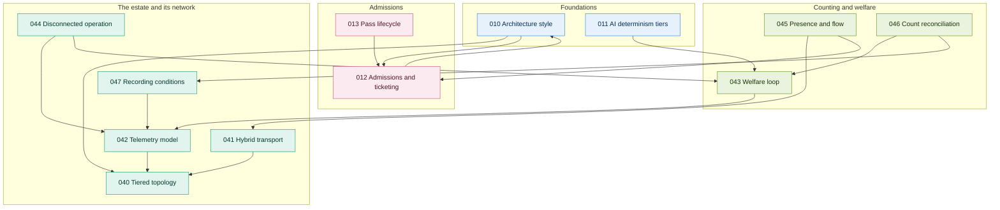

# 00. Decision map

**Go straight to:** [Home](../../README.md) · [ADRs](../adrs/README.md) · [Diagrams](README.md) · [Implementation](../implementation.md) · [Requirements](../requirements.md) · [Characteristics](../architecture-characteristics.md) · [Brief](../kata-brief.pdf)

Every record in this repository, and what each one rests on. An arrow means the record at
the tail cannot stand without the record at the head.

Four chains run through it. Follow any one and the argument holds on its own.

## The four chains

**Connectivity.** [040](../adrs/040-connectivity-topology.md) →
[041](../adrs/041-hybrid-transport.md) → [042](../adrs/042-telemetry-model.md) →
[044](../adrs/044-disconnected-operation.md). Where the truth lives, how readings travel,
what shape they arrive in, and what happens when they cannot travel at all. 041 amends
040 in public rather than rewriting it.

**Welfare.** [042](../adrs/042-telemetry-model.md) →
[043](../adrs/043-welfare-loop.md) → [047](../adrs/047-environment-and-weather.md).
Readings become an authority boundary: a vet's fixed limits may act, a model may only
suggest. 047 records conditions and interventions on one clock so the question can be
asked again later.

**Admissions.** [010](../adrs/010-architecture-style.md) →
[012](../adrs/012-admissions-and-ticketing.md) →
[013](../adrs/013-pass-lifecycle.md). The one part of the system with no AI in it, and
the reason a gate keeps working when the network does not.

**Counting.** [011](../adrs/011-ai-determinism-tiers.md) →
[046](../adrs/046-count-reconciliation.md) and
[045](../adrs/045-presence-and-flow.md). Two counting problems, one for fish and one for
people, solved the same way: a frequent cheap estimate corrected by a scarcer reliable
fact.

## What the shape shows

**Two records carry everything.** [010](../adrs/010-architecture-style.md) decides where
the truth lives; [011](../adrs/011-ai-determinism-tiers.md) decides how much of this
should be a model at all. Every other record traces back to one of them.

**The estate cluster is the densest.** Five records, and almost every arrow in the
diagram passes through [042](../adrs/042-telemetry-model.md). Patchy wifi is not one
problem among several — it is the constraint the rest of the design is shaped around.

**Nothing depends on a model provider.** No arrow in this map leads off the estate. The
capabilities that use a hosted model sit at the edges of the picture, and removing them
removes features rather than foundations.

---

❦

<a href="#00-decision-map">↑ Back to top</a> · <a href="../../README.md">Home</a> · <a href="../adrs/README.md">All ADRs</a> · <a href="README.md">All diagrams</a>

