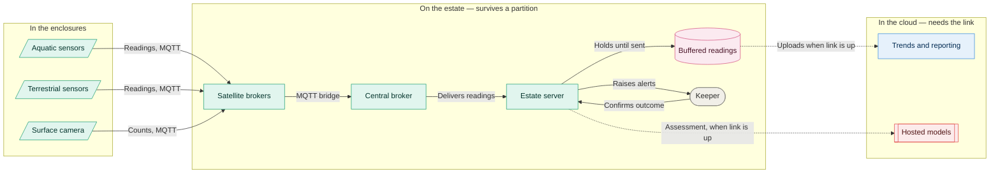

# 04. Edge connectivity

How a reading travels from an enclosure to the cloud, and what keeps working when the
estate loses its connection.

Solid arrows always work. Dotted arrows only work while the link is up.

Everything in the middle group runs on the estate, so safety alarms, the vet's limits and
a keeper's working day carry on when the connection does not. The satellite brokers buffer
for their own patch of the park; the estate server buffers for the estate as a whole.

Nothing in the cloud group is on the path to an alert. That is deliberate: an assessment we
cannot reach is an assessment we can do without.

See [040](../adrs/040-connectivity-topology.md) for the topology,
[042](../adrs/042-telemetry-model.md) for what travels,
[044](../adrs/044-disconnected-operation.md) for behaviour during an outage.
