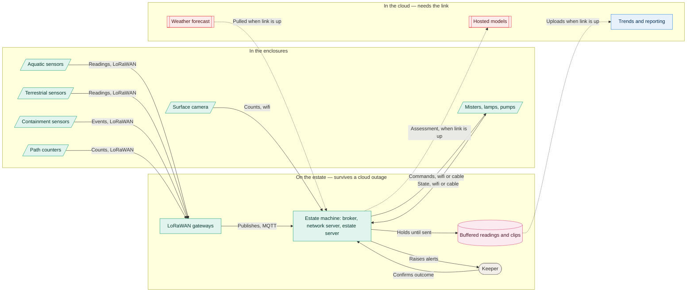
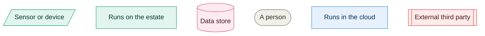

# 04. Edge connectivity

**Go straight to:** [Home](../../README.md) · [ADRs](../adrs/README.md) · [Diagrams](README.md) · [Implementation](../implementation.md) · [Requirements](../requirements.md) · [Characteristics](../architecture-characteristics.md) · [Brief](../kata-brief.pdf)

How a reading reaches the estate, and what keeps working when the estate loses its connection
to the outside world.

### Key

| Arrow | Meaning |
|---|---|
| Solid | Always works, connection or not |
| Dotted | Only while the link to the cloud is up |

Full team key in [README](README.md).

### Reading it

**Two radios, one protocol.** Sensors speak LoRaWAN, which reaches the middle of the estate
from anywhere on it, including the wifi dead zones. A LoRaWAN message is a few dozen bytes, so
anything larger stays on wifi: the camera publishes counts rather than frames, and the
equipment is reached over wifi or cable because LoRaWAN cannot deliver a command promptly
([041](../adrs/041-hybrid-transport.md)).

**Equipment reports back.** The arrow from the equipment is as important as the one to it.
Commanded on and actually on are different facts, and only the second is evidence
([047](../adrs/047-environment-and-weather.md)).

**One box, not four.** The broker, the LoRaWAN network server and the estate server run on one
machine. Keeping the network server on the estate is what lets sensor data stay readable during
a cloud outage. It is also a single point of failure, named as the largest open risk in
[041](../adrs/041-hybrid-transport.md).

**Nothing in the cloud group is on the path to an alert.** An assessment we cannot reach is one
we can do without. The forecast is the only inbound cloud arrow, and it buys warning time
rather than triggering anything ([047](../adrs/047-environment-and-weather.md)).

See [040](../adrs/040-connectivity-topology.md) for what runs on the estate and what runs in
the cloud, [042](../adrs/042-telemetry-model.md) for what travels, and
[044](../adrs/044-disconnected-operation.md) for the three kinds of outage and how each behaves.

---

❦

<a href="#04-edge-connectivity">↑ Back to top</a> · <a href="../../README.md">Home</a> · <a href="../adrs/README.md">All ADRs</a> · <a href="README.md">All diagrams</a>

