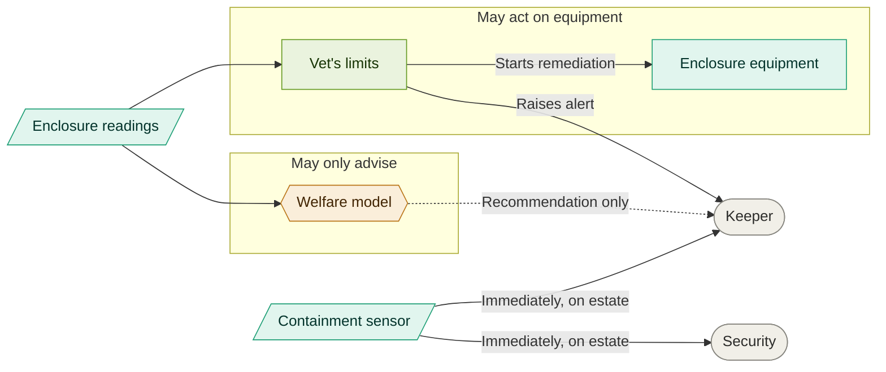
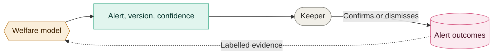

# 05. Welfare monitoring

Two views. What is allowed to act on equipment, and how we find out whether the model is
still any good.

## Who may act

The model has no arrow to the equipment, and that absence is the decision. A limit written
by a vet can start a pump on its own. Anything the model works out reaches a person and
stops there, which is why its one arrow is dotted.

The containment sensor passes both. A door is open or it is not, so nothing interprets it
and nobody waits on a model.

Decided in [043](../adrs/043-welfare-loop.md).

## How we know the model still works

Every alert a keeper closes tells us whether the model was right. That evidence costs no
extra staff time, because closing an alert has to happen anyway.

One wrong alert is noise. The same animal repeatedly means our idea of its normal is wrong.
Many animals at once means the model has drifted, a sensor is dirty, or something changed
that nobody recorded.

Also in [043](../adrs/043-welfare-loop.md).
