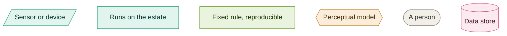
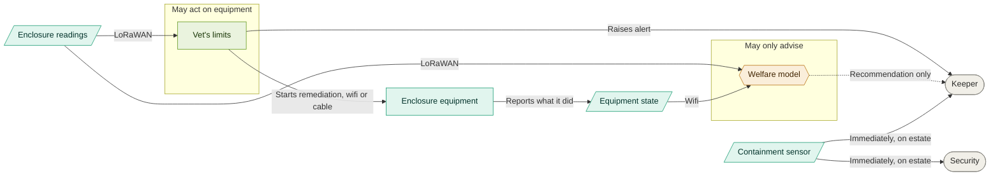
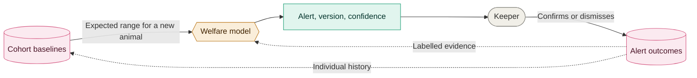

# 05. Welfare monitoring

Two views. What is allowed to act on equipment, and how we find out whether the model is still
any good.

### Key

| Arrow | Meaning |
|---|---|
| Solid | Happens on its own |
| Dotted | Advice only, a person decides |

Green is tier 1 and amber is tier 2, from [011](../adrs/011-ai-determinism-tiers.md). Full team
key in [README](README.md).

## Who may act

The model has no arrow to the equipment. A limit written by a vet can start a pump on its own.
Anything the model works out reaches a person and stops there, which is why its one arrow is
dotted. Decided in [043](../adrs/043-welfare-loop.md).

Readings arrive over LoRaWAN, but commands do not travel back that way: a LoRaWAN device only
listens briefly after transmitting, so equipment is reached over wifi or cable
([041](../adrs/041-hybrid-transport.md)).

Equipment reports its own state rather than only receiving instructions. Commanded on and
actually on are different facts, and only one is evidence
([047](../adrs/047-environment-and-weather.md)). That loop is also how a failed mister or lamp
is distinguished from a sick animal.

The containment sensor passes both boxes. A door is open or it is not, so nothing interprets it
and nobody waits on a model.

## How we know the model still works

Every alert a keeper closes tells us whether the model was right. That evidence costs no extra
staff time, because closing an alert has to happen anyway.

A new animal has no history, so its expected range starts as its cohort's, meaning same
species, archetype and season, and becomes its own as outcomes accumulate
([047](../adrs/047-environment-and-weather.md)).

One wrong alert is noise. The same animal repeatedly means our idea of its normal is wrong.
Many animals at once means the model has drifted, a sensor is dirty, or something changed that
nobody recorded.

Also in [043](../adrs/043-welfare-loop.md).
