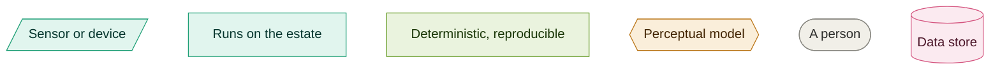
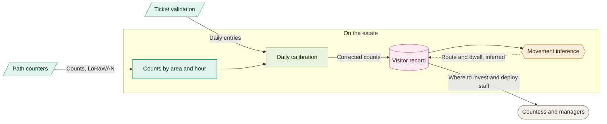
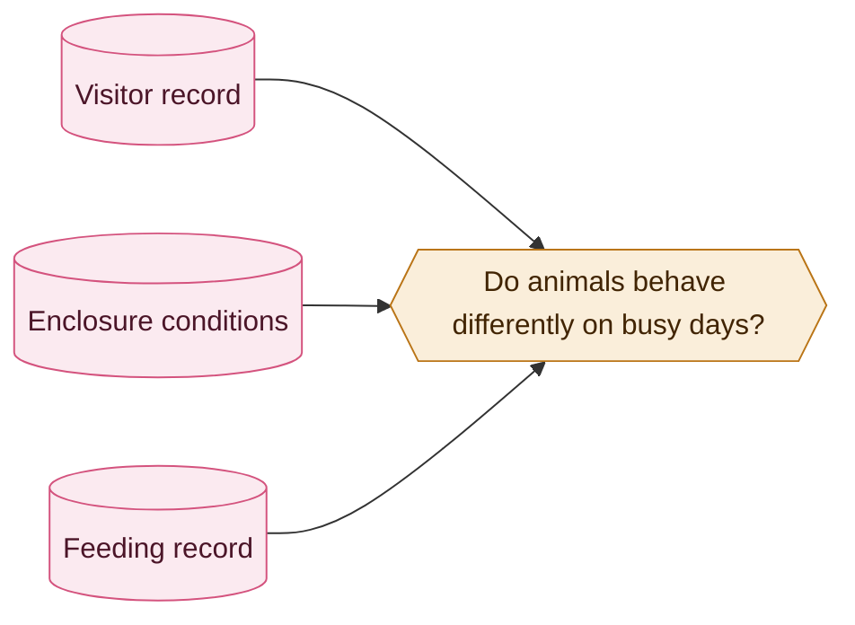

# 06. Presence and flow

Counting visitors without creating anything that identifies one. Decided in
[045](../adrs/045-presence-and-flow.md).

### Key

| Arrow | Meaning |
|---|---|
| Solid | A recorded fact |
| Dotted | An inference, presented as one |

Green is tier 1 and amber is tier 2, from [011](../adrs/011-ai-determinism-tiers.md). Full team
key in [README](README.md).

## Counting, and checking the count

**Nothing here can identify a visitor.** Beam-break, thermal and time-of-flight counters
produce a number and nothing else: no image, no device address, nothing linkable to a person
afterwards. That is a property of the equipment rather than a policy, so there is no record to
protect and none to hand over.

Counters undercount groups walking abreast, and family passes mean groups are common. Daily
gate entries against daily counter totals give a correction factor per counter. Same pattern as
[046](../adrs/046-count-reconciliation.md): a frequent cheap estimate corrected by a scarcer
reliable figure.

Only the movement inference is a model, and it is the only dotted arrow. The gate total is its
one independent check, which catches gross errors and not subtle ones.

## The same counts are welfare data

Visitor counts are recorded by area on the same clock as feeding and enclosure conditions
([047](../adrs/047-environment-and-weather.md)), so whether crowding affects particular species
becomes answerable later. We are not claiming it does. The data to test it costs nothing extra
once the counters exist.

If a relationship turns out to be real, feeding schedules move, which would be a welfare
improvement derived from a visitor sensor.
