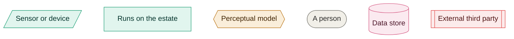

# 07. Ride condition

**Go straight to:** [Home](../../README.md) · [ADRs](../adrs/README.md) · [Diagrams](README.md) · [Implementation](../implementation.md) · [Requirements](../requirements.md) · [Characteristics](../architecture-characteristics.md) · [Brief](../kata-brief.pdf)

How a change in a ride's mechanical behaviour reaches the person who decides what to do about
it, and where the authority to stop a ride sits. Decided in
[060](../adrs/060-ride-condition-monitoring.md).

```mermaid
%%{init: {'flowchart': {'nodeSpacing': 55, 'rankSpacing': 75, 'curve': 'basis', 'padding': 12}}}%%
flowchart LR

  subgraph rides["On the rides — nothing drilled, bolted or bonded"]
    accel[/Clamp-on accelerometers/]
    mic[/Surface microphones/]
    nomount[/Ride with no mounting point/]
  end

  subgraph estate["On the estate"]
    box[Estate machine]
    hist[(Per-ride history)]
    model{{Condition signature<br/>Tier 2, advises only}}
    advisory[Advisory, no authority]
  end

  engineer([Engineer])
  inspection[[Statutory inspection]]
  closure[Ride stopped or cleared]
  maint[Planned maintenance]
  disp[(Disposition log)]
  drift[022 drift monitor]

  accel -->|Summary features, LoRaWAN| box
  mic -->|Raw audio, wifi| box
  box -->|Readings and temperature| hist
  hist -->|Its own baseline| model
  model -->|Divergence from normal| advisory
  advisory -->|Suggests a look| engineer
  nomount -->|No sensor, inspection alone| inspection
  engineer -->|Schedules the work| maint
  engineer -->|Finding on every advisory| disp
  inspection -->|Opens, closes or clears| closure
  inspection -->|Outcome, on its own schedule| disp
  disp --> drift

  classDef t1 fill:#EAF3DE,stroke:#639922,color:#173404
  classDef t2 fill:#FAEEDA,stroke:#BA7517,color:#412402
  classDef t3 fill:#EEEDFE,stroke:#7F77DD,color:#26215C
  classDef edge fill:#E1F5EE,stroke:#1D9E75,color:#04342C
  classDef cloud fill:#E6F1FB,stroke:#378ADD,color:#042C53
  classDef human fill:#F1EFE8,stroke:#888780,color:#2C2C2A
  classDef store fill:#FBEAF0,stroke:#D4537E,color:#4B1528
  classDef ext fill:#FCEBEB,stroke:#E24B4A,color:#501313

  class accel,mic,nomount,box,advisory edge
  class model t2
  class hist,disp store
  class engineer human
  class inspection ext
  class drift cloud
```

### Key

Amber is Tier 2, from [011](../adrs/011-ai-determinism-tiers.md). The uncoloured boxes are
outcomes rather than components. Full team key in [README](README.md).

### Reading it

**The sensing is what the rides allow.** Clamp-on and surface-mounted accelerometers and
microphones, on structure rather than fabric, because the rides are 18th-century and
historically important and their value limits what may be physically modified
([C7](../requirements.md#constraints)). A ride offering no acceptable mounting point gets no
sensor and stays on inspection alone, so coverage is a consequence rather than a target
([060](../adrs/060-ride-condition-monitoring.md)).

**Each ride is compared against itself.** Forty rides of different ages and mechanisms share no
useful threshold, so the model learns one signature per ride from that ride's own recorded
history, with ambient temperature carried alongside because metal sounds different on a cold
morning ([060](../adrs/060-ride-condition-monitoring.md),
[047](../adrs/047-environment-and-weather.md)).

**Nothing from the model reaches the closure box.** The model reports divergence, and the
advisory it raises carries no authority. Only the statutory inspection opens, closes or clears a
ride, which is the same boundary [043](../adrs/043-welfare-loop.md) draws for animals. A real
fault the model saw can still reach a visitor, and that is the accepted trade rather than an
oversight ([060](../adrs/060-ride-condition-monitoring.md)).

**The engineer's finding is the measurement.** Every advisory is closed as genuine, not genuine,
or unclear, and that disposition is what [022](../adrs/022-detecting-ai-misbehaviour.md) reads
to detect drift. The inspection outcome arrives on its own schedule and owes the system nothing,
which is what makes it independent ground truth
([060](../adrs/060-ride-condition-monitoring.md)).

See [041](../adrs/041-hybrid-transport.md) for why features travel over LoRaWAN and audio over
wifi, [042](../adrs/042-telemetry-model.md) for the topic shape and delivery guarantees, and
[044](../adrs/044-disconnected-operation.md) for buffering and replay during an outage.

---

❦

<a href="#07-ride-condition">↑ Back to top</a> · <a href="../../README.md">Home</a> · <a href="../adrs/README.md">All ADRs</a> · <a href="README.md">All diagrams</a>

