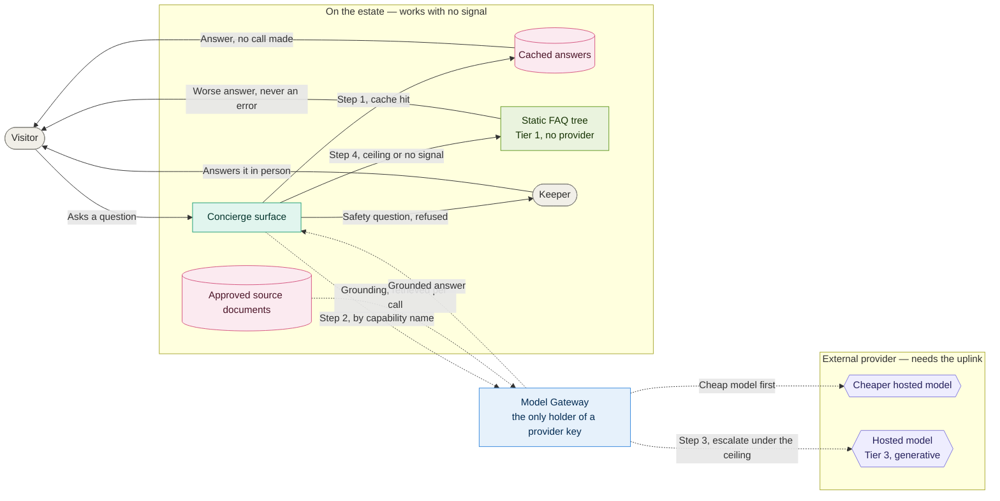
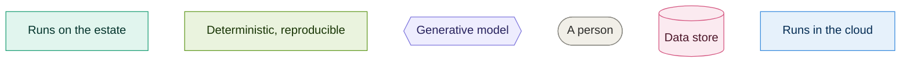

# 08. Concierge offline behaviour

**Go straight to:** [Home](../../README.md) · [ADRs](../adrs/README.md) · [Diagrams](README.md) · [Implementation](../implementation.md) · [Requirements](../requirements.md) · [Characteristics](../architecture-characteristics.md) · [Brief](../kata-brief.pdf)

What a visitor's question reaches when the uplink is up, and what it reaches when there is no
signal at all. Decided in [062](../adrs/062-visitor-concierge.md), routed by
[020](../adrs/020-model-gateway.md).

### Key

| Arrow | Meaning |
|---|---|
| Solid | Always works, connection or not |
| Dotted | Only while the link to the cloud is up |

Green is Tier 1 and purple is Tier 3, from [011](../adrs/011-ai-determinism-tiers.md). Full team
key in [README](README.md).

### Reading it

**Everything inside the estate group answers without a provider.** The cache, the approved source
documents and the static FAQ tree sit on the estate, which is the guarantee
[044](../adrs/044-disconnected-operation.md) gives everything else on site. A visitor gets a
worse answer, never an error page ([062](../adrs/062-visitor-concierge.md)).

**The dotted arrows are the whole of the cloud dependency.** The surface asks for a capability by
name rather than naming a vendor, and the gateway is the only thing holding a provider key, so a
provider change is a configuration row ([020](../adrs/020-model-gateway.md)).

**The numbered steps are the degradation ladder.** A cache hit answers with no call at all; a
miss goes to the cheaper model; an answer that is not confident or not grounded escalates to the
full model only while the capability is under its cost ceiling; at the ceiling the request drops
to the FAQ tree, which depends on no provider ([implementation](../implementation.md),
[020](../adrs/020-model-gateway.md)).

**The refusal path never reaches a model.** Anything touching proximity,
handling, allergy or venom is refused and handed to a keeper, enforced as a refusal case in
[021](../adrs/021-evaluating-ai-before-release.md)'s golden set. Every remaining factual claim
must trace to a source document the gateway retrieved for that call, or it is not said
([062](../adrs/062-visitor-concierge.md)).

---

❦

<a href="#08-concierge-offline-behaviour">↑ Back to top</a> · <a href="../../README.md">Home</a> · <a href="../adrs/README.md">All ADRs</a> · <a href="README.md">All diagrams</a>

