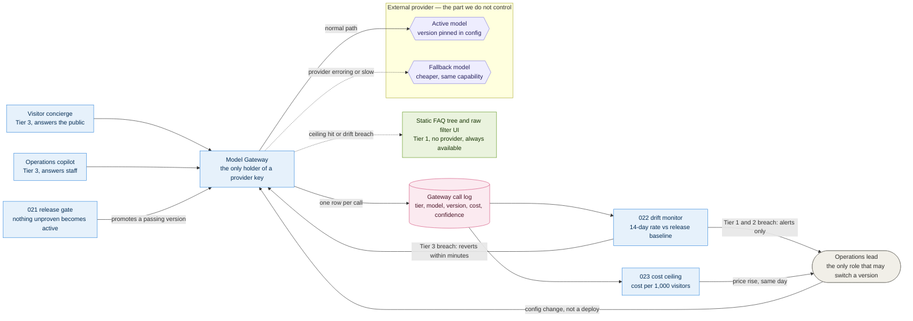
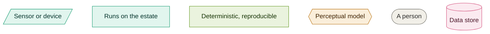

# 09. Model gateway

**Go straight to:** [Home](../../README.md) · [ADRs](../adrs/README.md) · [Diagrams](README.md) · [Implementation](../implementation.md) · [Requirements](../requirements.md) · [Characteristics](../architecture-characteristics.md) · [Brief](../kata-brief.pdf)

What sits between the two Tier 3 capabilities and any external provider: one gateway,
a ranked fallback per capability, and the log that feeds evaluation, drift detection
and cost control from a single source. Behind [020](../adrs/020-model-gateway.md).

## Reading it

- **Solid arrows** are the request path. Both capabilities only ever call the gateway,
  so a provider change is one config row rather than an edit everywhere.
- **Dashed arrows** are the failure paths, and the important one is the second: when the
  cost ceiling is hit or the drift monitor breaches, the capability drops to the green
  box. Green is Tier 1 — a fixed decision tree and a plain filter interface that existed
  before the AI did. It cannot be taken away by a provider, because it does not have one.
- The **call log** is one write read by three consumers. [021](../adrs/021-evaluating-ai-before-release.md) samples it for audit,
  [022](../adrs/022-detecting-ai-misbehaviour.md) reads it for drift, [023](../adrs/023-ai-cost-control.md) reads it for cost. One schema, not three.
- The two models sit inside the provider box and are coloured by tier rather than by who
  hosts them, per the [diagram key](README.md#the-key). Everything outside that box keeps working if the box goes dark.
- Only the operations lead can move the active pointer, and only to a version [021](../adrs/021-evaluating-ai-before-release.md) has
  already passed. Fast to flip, not fast to flip unsafely.

## Open questions

- Whether shadowing (calling a candidate silently alongside the incumbent) is worth
  building before canarying is needed at real volume, or whether canary-only is enough
  given [C8](../requirements.md#constraints)'s growth curve.

---
  ### Key

| Arrow | Meaning |
|---|---|
| Solid | A recorded fact |
| Dotted | An inference, presented as one |

Green is tier 1 and amber is tier 2, from [011](../adrs/011-ai-determinism-tiers.md). Full team
key in [README](README.md).

---

❦

<a href="#09-model-gateway">↑ Back to top</a> · <a href="../../README.md">Home</a> · <a href="../adrs/README.md">All ADRs</a> · <a href="README.md">All diagrams</a>

