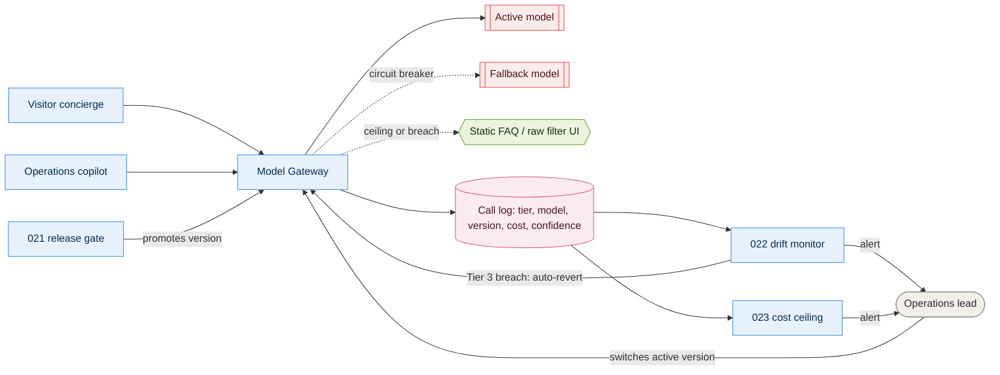

# 09. Model gateway

What sits between the two Tier 3 capabilities and any external provider: one gateway,
a ranked fallback per capability, and the log that feeds evaluation, drift detection
and cost control from a single source. Behind [020](../adrs/020-model-gateway.md).

## Reading it

- **Solid arrows** are the request path. Both capabilities only ever call the gateway —
  neither holds a provider SDK.
- **Dashed arrows** are what happens when things go wrong: the circuit breaker to a
  cheaper or self-hosted fallback, and the drop to the Tier 1 static path when a cost
  ceiling or drift breach forces it. The static path depends on no provider at all.
- The **call log** is one write, read by three consumers — 021 needs it for audit
  sampling, 022 needs it for drift, 023 needs it for cost. One schema, not three.
- Only the operations lead can move the active pointer, and only to a version 021 has
  already passed.

## Open questions

- Whether shadowing (calling a candidate silently alongside the incumbent) is worth
  building before canarying is needed at real volume, or whether canary-only is enough
  given C8's growth curve.
