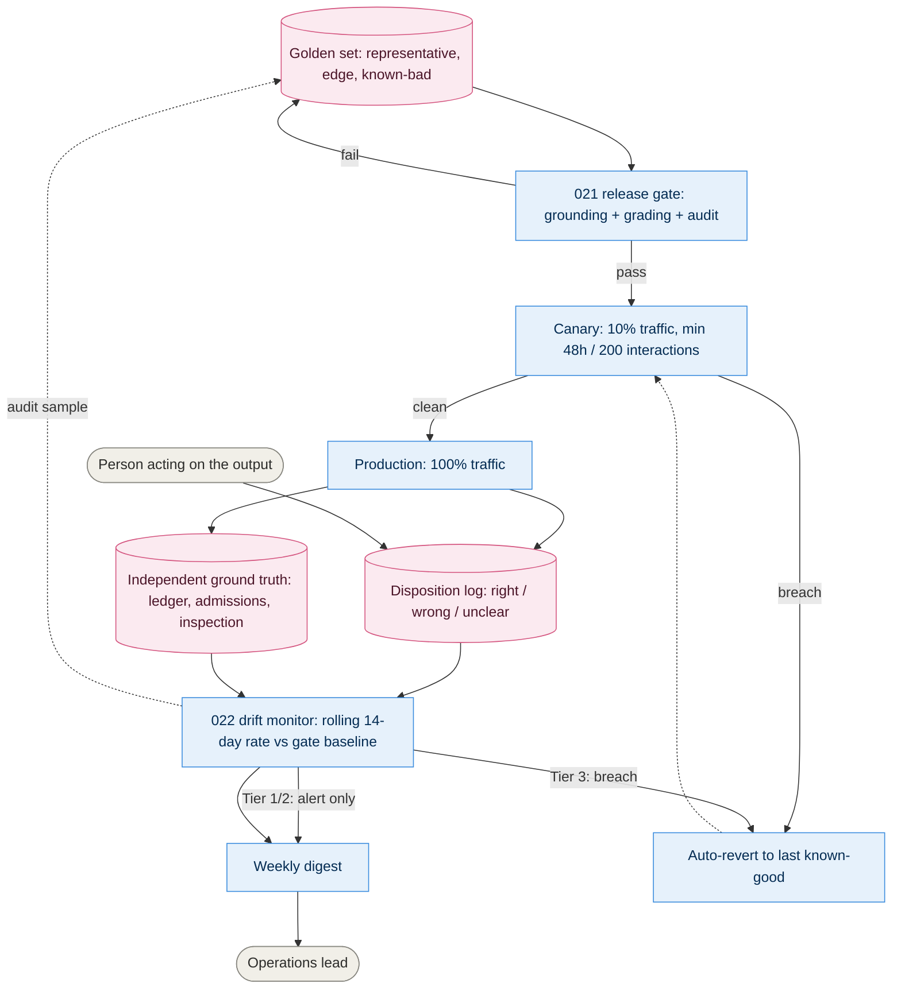

# 10. Evaluation and drift loop

How a model or prompt version earns its way to production, and how we know if it stops
deserving to stay there. Behind [021](../adrs/021-evaluating-ai-before-release.md) and
[022](../adrs/022-detecting-ai-misbehaviour.md).

## Reading it

- The top half is **before release** (021): nothing reaches even a canary slice without
  passing the golden set.
- The bottom half is **after release** (022): the disposition log and the ground-truth
  comparison are the same two signals whether the capability is a day old or a year old
  — there is no separate "monitoring" system to build.
- The loop closes twice: a **breach** reverts to the last known-good version (dashed,
  back toward canary/gateway), and an **audit finding** adds a case to the golden set
  (dashed, back to the top), so the gate gets stricter over time instead of staying
  static.
- Tier 1/2 and Tier 3 diverge only at the monitor: Tier 1/2 always has a person or a
  ledger downstream already, so a breach alerts; Tier 3 has no such backstop, so a
  breach reverts automatically and then alerts.

## Open questions

- Whether 14 days and 10 percentage points (022) are the right sensitivity once real
  disposition data exists, or whether they need tuning per capability rather than one
  shared threshold.
