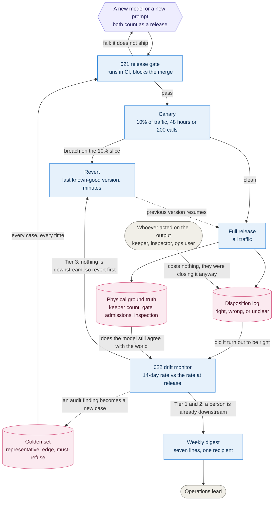

# 10. Evaluation and drift loop

**Go straight to:** [Home](../../README.md) · [ADRs](../adrs/README.md) · [Diagrams](README.md) · [Implementation](../implementation.md) · [Requirements](../requirements.md) · [Characteristics](../architecture-characteristics.md) · [Brief](../kata-brief.pdf)

How a model or prompt version earns its way to production, and how we know if it stops
deserving to stay there. Behind [021](../adrs/021-evaluating-ai-before-release.md) and
[022](../adrs/022-detecting-ai-misbehaviour.md).

## Reading it

- Read it top to bottom once and the shape is: **nothing ships unproven, nothing stays
  unwatched.** The top half is [021](../adrs/021-evaluating-ai-before-release.md), the bottom half is [022](../adrs/022-detecting-ai-misbehaviour.md), and they share the
  golden set, so the same evidence works before and after release.
- A prompt edit enters at the same top box as a new model. That is the point of the
  label: wording is how grounding and refusal behaviour break, so it gets the full gate.
- The two pink stores are the whole detection strategy. Neither costs anything to
  produce: the **disposition** is a keeper closing an alert they had to close anyway,
  and the **ground truth** is a count somebody was already taking. No labelling project,
  no data team.
- The two arrows out of the monitor are the one place tiers behave differently, and the
  edge labels say why rather than just what. Tier 1 and 2 always have a person or a
  physical count standing behind them ([043](../adrs/043-welfare-loop.md), [045](../adrs/045-presence-and-flow.md), [046](../adrs/046-count-reconciliation.md)), so an alert is enough.
  Tier 3 has nothing behind it, so the gateway reverts first and tells someone after.
- The loop closes twice. A breach puts the last known-good version back. An audit
  finding becomes a new golden-set case, so the gate gets stricter over time instead of
  aging into a formality.

## Open questions

- Whether 14 days and 10 percentage points ([022](../adrs/022-detecting-ai-misbehaviour.md)) are the right sensitivity once real
  disposition data exists, or whether they need tuning per capability rather than one
  shared threshold.

---

❦

<a href="#10-evaluation-and-drift-loop">↑ Back to top</a> · <a href="../../README.md">Home</a> · <a href="../adrs/README.md">All ADRs</a> · <a href="README.md">All diagrams</a>

