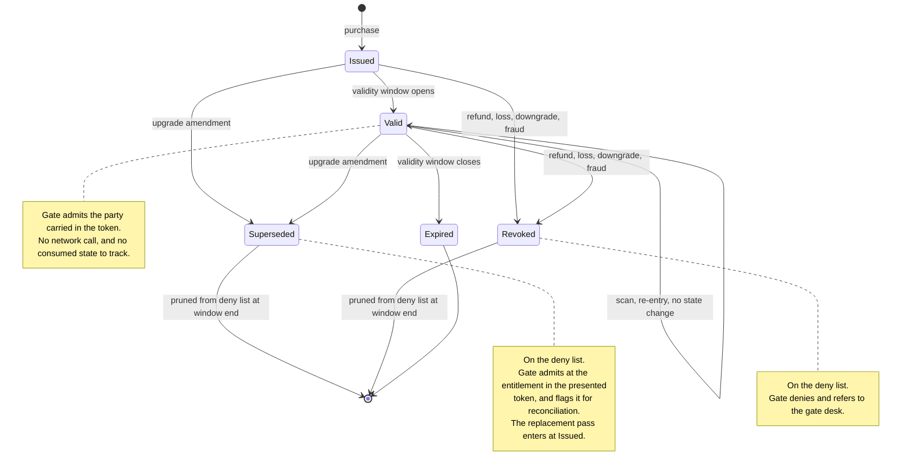

# 11. Pass lifecycle

Every state a pass moves through from purchase to expiry, and what a gate does in each.
This is the picture behind [013](../adrs/013-pass-lifecycle.md).

State diagrams are uncoloured — see the [key](README.md#state-diagrams).

## What the picture is for

**The self-transition on `Valid` is the whole simplification.** A scan changes nothing. That
is what "re-entry is allowed" buys: consumption is the one piece of pass state that would
change at the gate rather than at purchase, and so the one piece that could not be
established offline. Remove it and the deny list is the only shared state a scanner needs.

**Only two states sit on the deny list**, and both leave it when their validity window
closes. That is the pruning rule that keeps the list at roughly 22 KB rather than growing
without bound — the sizing argument in [013](../adrs/013-pass-lifecycle.md).

**`Superseded` and `Revoked` differ only in what the gate does.** Both are amendments in the
admissions monolith; both land on the same list. Splitting them is what stops a family who
paid to add a child being turned away for holding the original QR code.

## Open questions

- Should `Issued` and `Valid` be one state? They differ only by date, and the gate treats a
  pass outside its window as expired either way. Two states make the amendment-before-the-
  window case visible, which is why they are drawn apart here.
- Does a `Lost` state earn separation from `Revoked`? The gate behaviour is identical. It
  would only matter if reissue-after-loss were priced differently from a refund.
- Annual passes sit in `Valid` for thirteen months and cross a key rotation while they do.
  Nothing here shows that, and it may want its own picture if the key set gets interesting.
