# Diagrams

Diagrams are written as Mermaid inside Markdown. GitHub renders them, so the source and
the picture are the same file and cannot drift apart. No export step, no `.png` to keep
in sync.

To edit one, edit the fenced block. To add one, copy an existing file.

| Diagram | Shows | Behind it |
|---|---|---|
| [00 Decision map](00-decision-map.md) | Every record, what it rests on, and the four chains through them | — |
| [01 System context](01-system-context.md) | Who uses the estate systems, and what we depend on outside them | — |
| [02 Container view](02-container-view.md) | The whole system on one page | [010](../adrs/010-architecture-style.md) |
| [03 AI capability map](03-ai-capability-map.md) | Every AI capability, its tier, and what it is allowed to do | [011](../adrs/011-ai-determinism-tiers.md) |
| [04 Edge connectivity](04-edge-connectivity.md) | Brokers, buffering, and what survives a partition | [040](../adrs/040-connectivity-topology.md), [041](../adrs/041-hybrid-transport.md) |
| [05 Welfare monitoring](05-welfare-monitoring.md) | Enclosure sensors through to a keeper acting on an alert | [043](../adrs/043-welfare-loop.md) |
| [06 Presence and flow](06-presence-and-flow.md) | Counting visitors without identifying one | [045](../adrs/045-presence-and-flow.md) |
| 07 Ride condition **[add or remove]** | Sensing, advisory, and the inspection boundary | [060](../adrs/060-ride-condition-monitoring.md) |
| 08 Concierge offline behaviour **[add or remove]** | What is cached at the gate, and what needs a signal | [062](../adrs/062-visitor-concierge.md) |
| [09 Model gateway](09-model-gateway.md) | How a capability request is routed, and how a model is replaced | [020](../adrs/020-model-gateway.md) |
| [10 Evaluation and drift loop](10-evaluation-loop.md) | Gates before release, and detection afterwards | [021](../adrs/021-evaluating-ai-before-release.md), [022](../adrs/022-detecting-ai-misbehaviour.md) |
| [11 Pass lifecycle](11-pass-lifecycle.md) | Every state a pass moves through, and what a gate does in each | [013](../adrs/013-pass-lifecycle.md) |

Rows marked **[add or remove]** do not exist yet. Before we submit, either the diagram
lands or the row comes out — an index that promises a picture nobody can open is worse
than a shorter index.

Start with 02 for the shape of the system and 03 for where AI sits inside it. The rest
are targeted views of one capability each.

## The key

Every diagram uses these shapes and colours and nothing else. If you need a new one, add
it here first so the rest of us know what it means.

```mermaid
flowchart LR
  comp[Component we build]
  person([A person])
  store[(Data store)]
  model{{AI or ML model}}
  device[/Physical sensor or device/]
  ext[[External third party]]

  comp --- person --- store --- model --- device --- ext

  classDef t1 fill:#EAF3DE,stroke:#639922,color:#173404
  classDef t2 fill:#FAEEDA,stroke:#BA7517,color:#412402
  classDef t3 fill:#EEEDFE,stroke:#7F77DD,color:#26215C
  classDef edge fill:#E1F5EE,stroke:#1D9E75,color:#04342C
  classDef cloud fill:#E6F1FB,stroke:#378ADD,color:#042C53
  classDef human fill:#F1EFE8,stroke:#888780,color:#2C2C2A
  classDef store fill:#FBEAF0,stroke:#D4537E,color:#4B1528
  classDef ext fill:#FCEBEB,stroke:#E24B4A,color:#501313

  class comp cloud
  class person human
  class store store
  class model t1
  class device edge
  class ext ext
```

**Shapes**

| Shape | Meaning |
|---|---|
| Rectangle | A component we build |
| Stadium | A person |
| Cylinder | A data store |
| Hexagon | An AI or ML model |
| Parallelogram | A physical sensor or device |
| Subroutine box | An external third party |

**Colours**

| Colour | Meaning |
|---|---|
| Green | Tier 1, classical and reproducible |
| Amber | Tier 2, perceptual |
| Purple | Tier 3, generative |
| Teal | Runs on the estate |
| Blue | Runs in the cloud |
| Grey | A person |
| Pink | A data store |
| Red | External third party |

Tier colours come from [011](../adrs/011-ai-determinism-tiers.md). Where a node is both
a model and on the estate, colour it by tier — the estate placement is usually obvious
from which subgraph it sits in.

Paste the eight `classDef` lines verbatim into any new diagram.

## State diagrams

The shapes and colours above describe components: things we build, people, stores, models,
devices, third parties. A state diagram has none of those — its boxes are states of one
thing — so the key does not apply to it.

Leave state diagrams uncoloured. Carry the meaning in transition labels and notes instead.
Reusing the tier colours would be actively misleading: amber means "Tier 2, perceptual" and
nothing else, and a state coloured amber in a diagram with no model in it invites exactly
the wrong reading. [11](11-pass-lifecycle.md) is the example to copy.

## House rules

- Keep node labels under about 30 characters.
- If a label needs a bracket, quote the whole label: `A["Gate scanner (offline)"]`.
- Reference every diagram from an ADR or `docs/overview.md`. Only what is linked gets
  read.
- Fewer boxes is better. If a diagram needs more than about 25, it is two diagrams.
