# Diagrams

Diagrams are written as Mermaid inside Markdown. GitHub renders them, so the source and
the picture are the same file and cannot drift apart. No export step, no `.png` to keep
in sync.

To edit one, edit the fenced block. To add one, copy an existing file.

| Diagram | Shows | Seat |
|---|---|---|
| [01 System context](01-system-context.md) | Who uses the estate systems and what we depend on | A |
| [02 Container view](02-container-view.md) | The whole system, one page | A |
| [03 AI capability map](03-ai-capability-map.md) | Every AI capability, its tier and its authority | A |
| [04 Edge connectivity](04-edge-connectivity.md) | Brokers, buffering, what survives a partition | C |
| [05 Welfare monitoring](05-welfare-monitoring.md) | Sensors to alert to keeper | C |
| [06 Presence and flow](06-presence-and-flow.md) | Counting without identifying | C |
| 07 Ride condition | Sensing, advisory, and the inspection boundary | D — **[add or delete reference]** |
| 08 Concierge offline behaviour | What is cached and what needs signal | D — **[add or delete reference]** |
| 09 Pass lifecycle | Issue, validate, reconcile | A — **[add or delete reference]**, sits on `adr/013-pass-lifecycle` |

Rows 01 to 06 exist. Rows marked **[add or delete reference]** do not exist in this
branch: either the diagram gets drawn or the row comes out before we submit. An index
that promises a picture nobody can open is worse than a shorter index.

## The key

Every diagram uses these shapes and colours and nothing else. If you need a new one, add
it here first so the rest of us know what it means.

```mermaid
flowchart LR
  comp[Component we build]
  person([A person])
  store[(Data store)]
  model{{AI or ML model}}
  device[/Physical sensor or device/]
  ext[[External third party]]

  comp --- person --- store --- model --- device --- ext

  classDef t1 fill:#EAF3DE,stroke:#639922,color:#173404
  classDef t2 fill:#FAEEDA,stroke:#BA7517,color:#412402
  classDef t3 fill:#EEEDFE,stroke:#7F77DD,color:#26215C
  classDef edge fill:#E1F5EE,stroke:#1D9E75,color:#04342C
  classDef cloud fill:#E6F1FB,stroke:#378ADD,color:#042C53
  classDef human fill:#F1EFE8,stroke:#888780,color:#2C2C2A
  classDef store fill:#FBEAF0,stroke:#D4537E,color:#4B1528
  classDef ext fill:#FCEBEB,stroke:#E24B4A,color:#501313

  class comp cloud
  class person human
  class store store
  class model t1
  class device edge
  class ext ext
```

**Shapes**

| Shape | Meaning |
|---|---|
| Rectangle | A component we build |
| Stadium | A person |
| Cylinder | A data store |
| Hexagon | An AI or ML model |
| Parallelogram | A physical sensor or device |
| Subroutine box | An external third party |

**Colours**

| Colour | Meaning |
|---|---|
| Green | Tier 1, classical and reproducible |
| Amber | Tier 2, perceptual |
| Purple | Tier 3, generative |
| Teal | Runs on the estate |
| Blue | Runs in the cloud |
| Grey | A person |
| Pink | A data store |
| Red | External third party |

Tier colours come from [011](../adrs/011-ai-determinism-tiers.md). Where a node is both
a model and on the estate, colour it by tier — the estate placement is usually obvious
from which subgraph it sits in.

Paste the eight `classDef` lines verbatim into any new diagram.

## House rules

- Keep node labels under about 30 characters.
- If a label needs a bracket, quote the whole label: `A["Gate scanner (offline)"]`.
- Reference every diagram from an ADR or `docs/overview.md`. Only what is linked gets
  read.
- Fewer boxes is better. If a diagram needs more than about 25, it is two diagrams.
