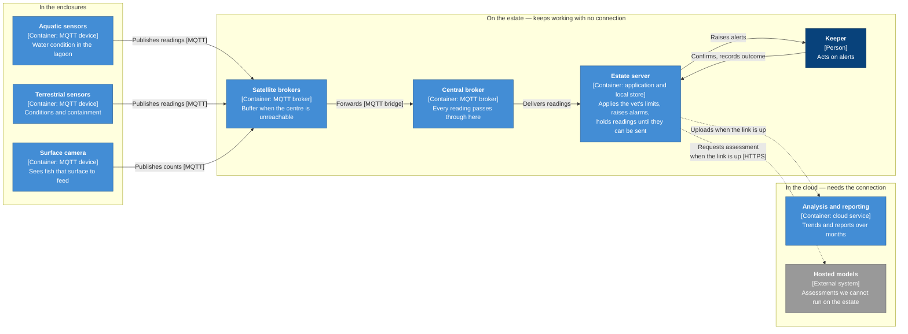
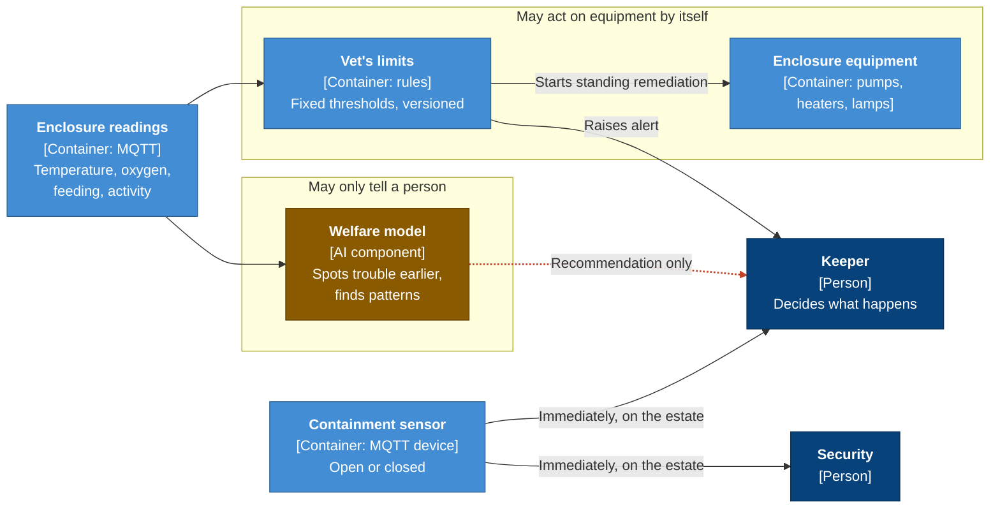
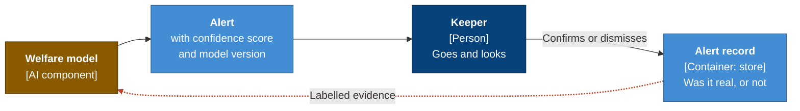

# Edge and animals

Diagrams for the estate network and animal welfare monitoring. Track C.

---

## From the enclosure to the cloud

C4 container view. How a reading travels, and what still works when the estate loses its connection.

**Key**

| | Meaning |
|---|---|
| Dark blue | A person |
| Mid blue | A container. Something we build, run or store data in |
| Grey | An external system we depend on but do not control |
| Solid arrow | Always available |
| Dashed arrow | Only while the connection is up |

Everything inside the middle group runs on the estate, so safety alarms, the vet's limits and a keeper's working day continue when the connection does not. See ADR-040 for the topology, ADR-042 for the readings, ADR-044 for behaviour during an outage.

---

## Who may act

Three kinds of input, and what each is allowed to do on its own.

**Key**

| | Meaning |
|---|---|
| Dark blue | A person |
| Mid blue | Something we build, run or store data in |
| Amber | A component whose behaviour comes from a model |
| Red dashed arrow | Cannot proceed without a person |

The model has no arrow to the equipment, and that absence is the decision. A limit written by a vet can start a pump on its own. Anything the model works out reaches a person and stops there.

The containment sensor passes both. A door is open or it is not, so nothing interprets it and nobody waits on a model. Decided in ADR-043.

---

## How we know the model still works

Every alert a keeper closes tells us whether the model was right. That evidence costs no extra staff time, because closing an alert has to happen anyway.

One wrong alert is noise. The same animal repeatedly means its normal is wrong. Many animals at once means the model has drifted, a sensor is dirty, or something changed that nobody recorded. See ADR-043.
