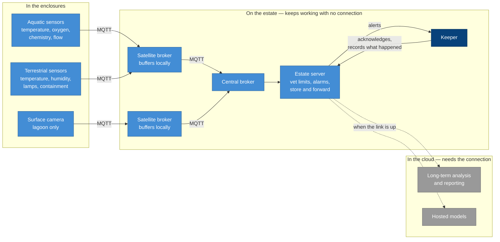

# Edge and animals

Diagrams for the estate network and the animal welfare monitoring. Track C.

---

## From the enclosure to the cloud

How a reading travels, and what still works when the estate loses its connection.

**Key**

| | Meaning |
|---|---|
| Dark blue | A person |
| Mid blue | Something we are building or running |
| Grey | Something outside the estate that we depend on |
| Solid arrow | Always available |
| Dashed arrow | Only when the connection is up |

Everything inside the middle group runs on the estate. Safety alarms, the vet's limits, and a keeper's whole working day sit on that side of the line, so none of them stop when the connection does. Decided in ADR-040, with the readings themselves defined in ADR-042 and the behaviour during an outage in ADR-044.
