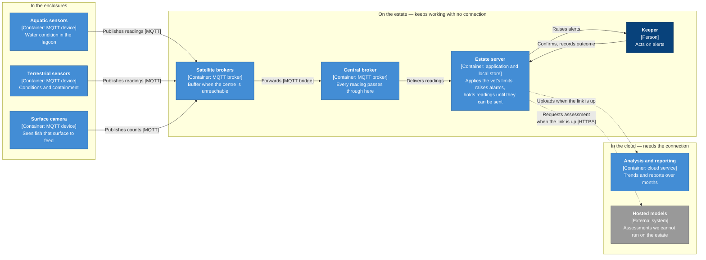

# Edge and animals

Diagrams for the estate network and animal welfare monitoring. Track C.

---

## From the enclosure to the cloud

C4 container view. How a reading travels, and what still works when the estate loses its connection.

**Key**

| | Meaning |
|---|---|
| Dark blue | A person |
| Mid blue | A container. Something we build, run or store data in |
| Grey | An external system we depend on but do not control |
| Solid arrow | Always available |
| Dashed arrow | Only while the connection is up |

Every box names what it is and what technology it runs on. Every arrow names its purpose, and its protocol where that matters.

Everything inside the middle group runs on the estate, so safety alarms, the vet's limits and a keeper's working day continue when the connection does not. See ADR-040 for the topology, ADR-042 for the readings, ADR-044 for behaviour during an outage.
